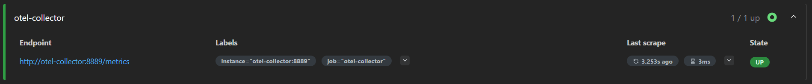
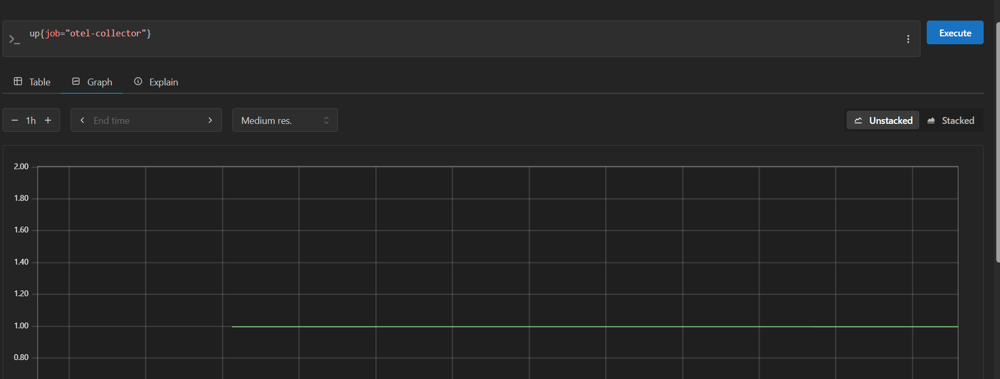

# Actividad 22 - Métricas con Prometheus y PromQL

## Tarea B1 - Verificación de Targets

### Estado de Targets en Prometheus

**URL de verificación**: http://localhost:9090/targets

### Explicación de Labels:
- **`job="otel-collector"`**: Identifica el rol o tipo de servicio que está siendo monitoreado. Agrupa todas las instancias del collector.
- **`instance="otel-collector:8889"`**: Especifica la instancia única (host:puerto) del target. Permite diferenciar múltiples instancias del mismo job.

### Captura de Estado:

    

## Tarea B2 - Consultas PromQL básicas

1. Estado general

    

2. Estado específico

    

Vemos que en ambos casos el resultado es 1 (up). Por último , no logramos encontrar las metricas http.

## Tarea B3 - Error rate 5xx (y cómo depurarlo si sale vacío)

