# Actividad  13 (Escribiendo infraestructura como código en un entorno local con Terraform)
Luis Andre Trujillo Serva
## Fase 0: Preparación
1. Preparamos la carpeta del **Laboratorio 05** y ejecutamos algunos archivos.
<p align="center">
    
<p/>

<p align="center">
    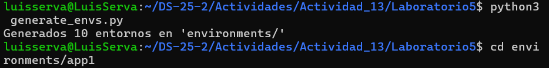
<p/>

<p align="center">
    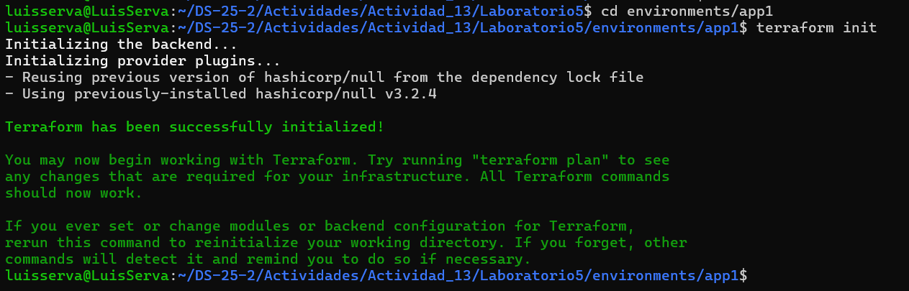
<p/>

## Fase 1: Expresando el cambio de infraestructura
Abrimos `modules/simulated_app/network.tf.json` y modificamos el `default` de `network` a `lab-net` . A continuación , generamos de nuevo los entornos y verificamos en alguno de los entornos que aparezca `"lab-net"` como valor por defecto en la variable "network".
<p align="center">
    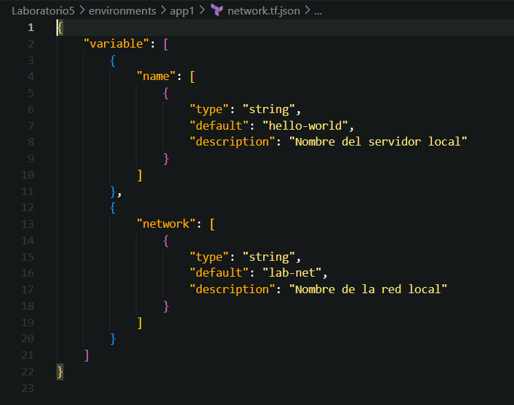
<p/>

### Preguntas

- ¿Cómo interpreta Terraform el cambio de variable?

Terraform no interpreta directamente el cambio como una modificación del recurso, sino como un nuevo valor de entrada para las configuraciones que usan esa variable.
Cuando ejecutamos `terraform plan`, el motor evalúa de nuevo los archivos `.tf.json` y detecta que el valor por defecto de la variable network cambió de `"local-network"` a `"lab-net"`.
Entonces, recalcula el plan de ejecución, determinando qué recursos dependen de esa variable y si ese cambio requiere recreación, actualización o ninguna acción.

- ¿Qué diferencia hay entre modificar el JSON vs. parchear directamente el recurso?

    - **Modificar el JSON (variable)**:
Cambias solo el valor de la variable, sin tocar la definición del recurso.
Terraform decidirá si ese cambio implica recrear o modificar recursos.
Esto mantiene la infraestructura declarativa y parametrizable, permitiendo regenerar entornos fácilmente.

    - **Parchear directamente el recurso**:
Cambias manualmente el valor dentro del bloque del recurso (por ejemplo, en main.tf.json).
En ese caso, Terraform detecta una diferencia estructural directa en el recurso, y podría planificar su recreación total, perdiendo parte de la flexibilidad del diseño modular.

- ¿Por qué Terraform no recrea todo el recurso, sino que aplica el cambio "in-place"?
  
Terraform mantiene un estado (state) donde registra los recursos existentes y sus atributos actuales.
Al detectar un cambio en una variable, compara el nuevo valor con el del estado.
Si el proveedor de Terraform (por ejemplo, google_compute_network) indica que ese atributo es mutable, entonces Terraform puede aplicar el cambio in-place, sin destruir ni recrear el recurso.

- ¿Qué pasa si editas directamente main.tf.json en lugar de la plantilla de variables?

Si editas `main.tf.json` directamente:
1) Estás alterando la plantilla base de la infraestructura (el recurso en sí).

2) Los entornos generados por generate_envs.py no recibirán ese cambio automáticamente, porque ellos se crean a partir de la plantilla que no fue regenerada.

3) Además, Terraform podría interpretar los cambios como modificaciones irreversibles del recurso, provocando destrucción y recreación total en lugar de simples actualizaciones.

## Fase 2: Entendiendo la inmutabilidad
### A. Remediación de 'drift' (out-of-band changes)
Al modificar manualmente el archivo `main.tf.json`, Terraform detecta una discrepancia entre el valor actual (`app2`) y el declarado (`hacked-app`).  
Dado que la propiedad `"name"` se encuentra dentro del bloque `triggers`, este cambio obliga a reemplazar completamente el recurso (`destroy and create replacement`), lo que refleja la **inmutabilidad** de ciertos atributos.

Si se restaura el valor original en el archivo (`"app2"`), Terraform reconoce que la configuración coincide nuevamente con el estado y no aplica ningún cambio.  
Esto demuestra cómo Terraform mantiene la coherencia entre su estado y el código fuente, detectando y corrigiendo automáticamente cambios fuera de banda (drift).

### B. Migrando a IaC
En esta parte se simuló la migración de un sistema manual (legacy) hacia un enfoque declarativo con Terraform.
Se creó un pequeño entorno con archivos `config.cfg` y `run.sh`, y un script Python (`migrate_legacy.py`) que lee estos parámetros para generar automáticamente los archivos `main.tf.json` y `network.tf.json`.

Al ejecutar `terraform plan`, Terraform detecta que debe crear un recurso `null_resource.legacy_app` con los parámetros extraídos del sistema legacy, demostrando cómo IaC permite convertir configuraciones manuales en definiciones reproducibles, auditables y versionadas.

## Fase 3: Escribiendo código limpio en IaC
### Control de versiones comunica contexto 
Realice dos commits en el archivo `network.tf.json`:
1. Cambie `default` de `name` a `server-01`.
2. Cambie la `descripcion` de la variable `name`.

<p align="center">
    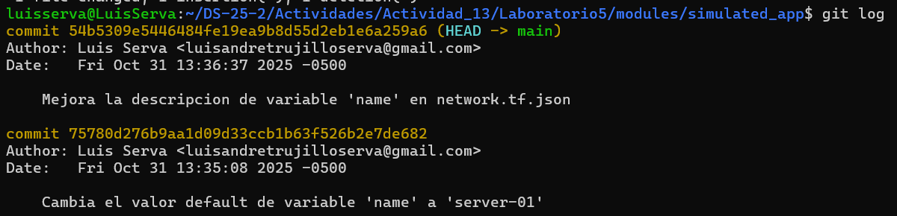
<p/>

### Linting y formateo	
El comando `jq` reescribe el archivo JSON con un formato uniforme, asegurando legibilidad y consistencia entre los miembros del equipo. No modifica la lógica, solo el estilo.

### Nomenclatura de recursos	
Se renombró el recurso `null_resource` a `local_server` para reflejar mejor su función, promoviendo semántica clara en el código IaC.

<p align="center">
    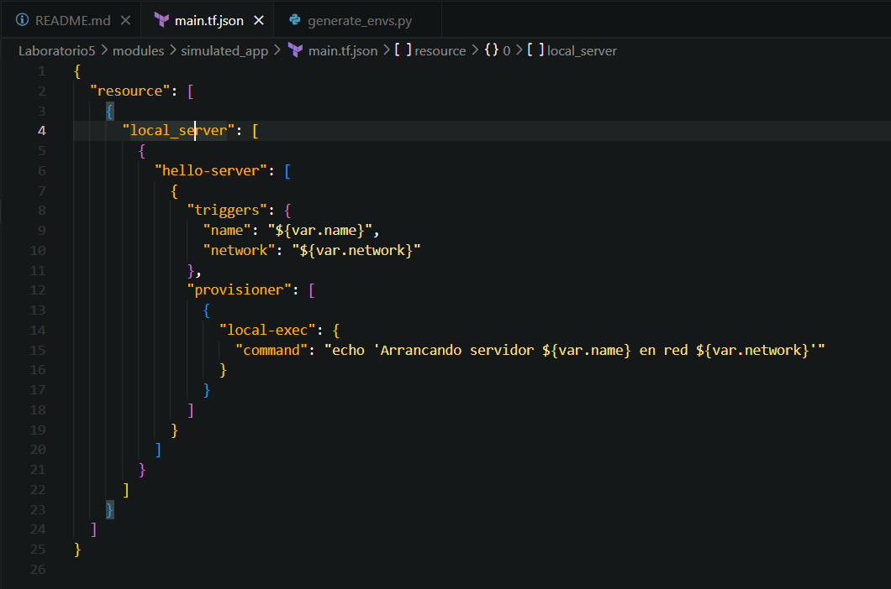
<p/>

<p align="center">
    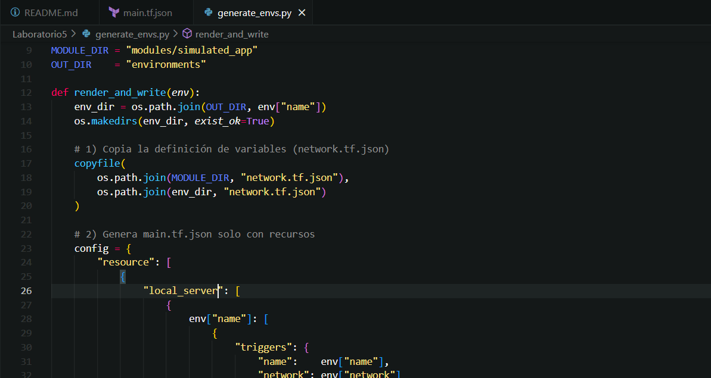
<p/>

### Variables y constantes	

Se añadió la variable port para parametrizar el puerto del servicio, evitando valores fijos y facilitando reutilización en entornos distintos.

<p align="center">
    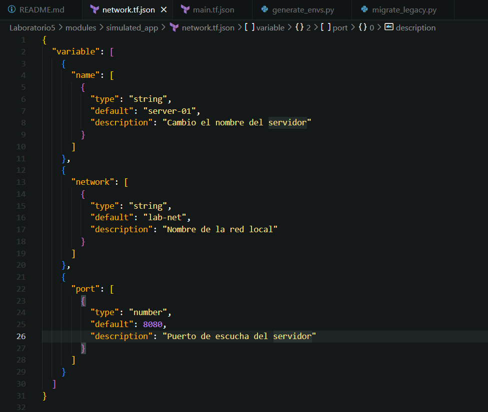
<p/>

<p align="center">
    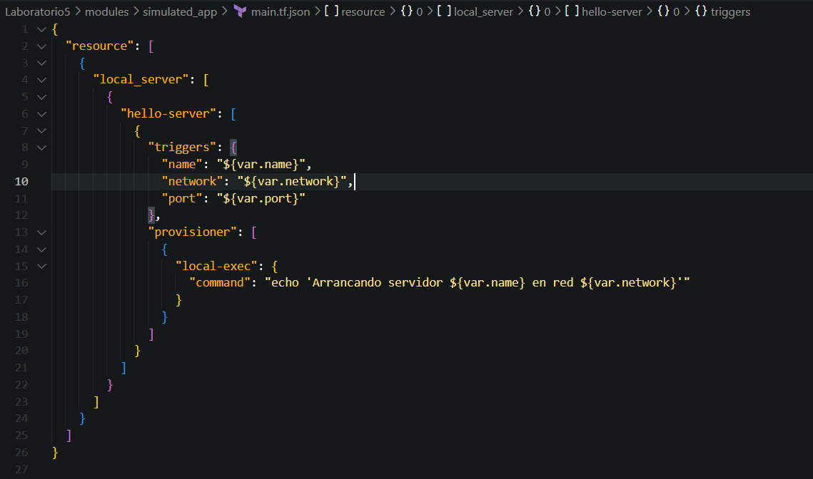
<p/>

### Parametrizar dependencias	
`env3` fue configurado para depender lógicamente del entorno `env2` mediante la red `net2-peered`.
Esto demuestra cómo el generador Python puede establecer relaciones declarativas entre entornos.

<p align="center">
    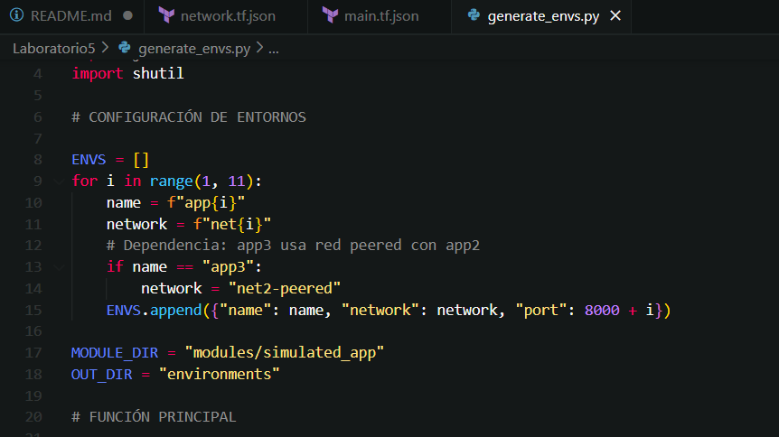
<p/>

### Mantener en secreto	
En el caso de `api_key` no hay valor por `default` , porque no debe almacenarse.

<p align="center">
    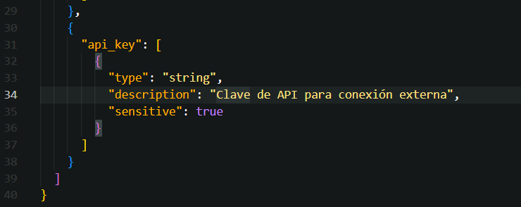
<p/>

También se realizarán modificaciones el el código `generate_envs.py`.
<p align="center">
    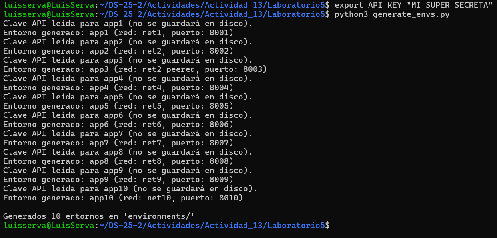
<p/>

En el paso final se añadió la variable `api_key` , marcada como `sensitive` en el JSON.
El script Python la obtiene desde la variable de entorno del sistema (`os.environ["API_KEY"]`),
sin almacenarla en disco, cumpliendo con las buenas prácticas de seguridad en IaC.

## Fase 4: Integración final y discusión
### 1. Recorrido por:
- Detección de drift (remediation):

Se genero entornos (`app1..app10`), se aplico `terraform apply` en al menos uno y comprobamos que, al editar `main.tf.json` manualmente, `terraform plan` detecta la deriva. Restaurando la configuración o aplicando la corrección, Terraform reconcilia el estado.
- Migración de legacy:

Se implemento `migrate_legacy.py` que lee `legacy/config.cfg` y `legacy/run.sh` y genera `network.tf.json` + `main.tf.json`. `terraform plan` sobre esos archivos refleja la configuración legacy.

- Estructura limpia y módulos:

Usas `modules/simulated_app/` como plantilla base; `generate_envs.py` genera entornos a partir de ese módulo. `main.tf.json` ahora usa `local_server` (nombre semántico), `port` es variable y `app3` depende de `app2`.

- Variables sensibles:

`api_key` está marcada `sensitive` en `network.tf.json`y la lees desde `os.environ` (no se guarda en disco). Buenas prácticas aplicadas: no versionar secretos, pasar por entorno/CI.

### 2. Preguntas abiertas:

**¿Cómo extenderías este patrón para 50 módulos y 100 entornos?**

Para entornos de gran escala, se recomienda:

- **Modularización**: separar la lógica en carpetas `modules/<componente>/` (por ejemplo, `modules/network`, `modules/server`, `modules/database`).
- **Plantillas parametrizables**: definir variables comunes (nombre, red, puerto, credenciales) y generar entornos dinámicamente desde un script (`generate_envs.py`) o un pipeline CI/CD.
- **Nomenclatura estandarizada**: usar un patrón uniforme como `team-app-env-component` para evitar colisiones.
- **Automatización GitOps**: al detectar cambios en los módulos, regenerar entornos y abrir pull requests automáticos con los `.tf.json` actualizados.
- **Estados independientes**: usar un backend remoto (por ejemplo, S3 o GCS) por entorno o módulo para aislar cambios y permitir despliegues paralelos.


**¿Qué prácticas de revisión de código aplicarías a los .tf.json?**
- **Formateo automático**: usar `jq . archivo > tmp && mv tmp archivo` o `json.dump(indent=4)` para garantizar estilo uniforme.
- **Linting y validación**: integrar validadores como jsonschema o terraform validate en el flujo de CI/CD.
- **Revisión en Pull Requests**: configurar pipelines que ejecuten terraform plan y publiquen el resultado en el PR para revisión manual antes del merge.
- **Commits atómicos y mensajes claros**: cada cambio debe tener un propósito específico, con mensajes descriptivos.
- **Checklist de revisión**:
    - JSON válido y formateado.
    - No hay secretos en texto plano.
    - terraform validate pasa sin errores.
    - Plan revisado y aprobado.

**¿Cómo gestionarías secretos en producción (sin Vault)?**
- **Variables de entorno cifradas**: definir claves (`API_KEY`, `DB_PASS`) como variables seguras en el sistema o CI/CD (GitHub Secrets, GitLab CI Variables, etc.).
- **Archivos locales no versionados**: usar un archivo `secure.json` o `.env` fuera del repositorio, accesible solo por el sistema de despliegue.
- **Cifrado con herramientas ligeras**: emplear `git-crypt` o `sops` para almacenar secretos cifrados en el repositorio si es necesario.
- **Principio de mínimo privilegio**: restringir quién puede acceder a los secretos y rotarlos periódicamente  

**¿Qué workflows de revisión aplicarías a los JSON generados?**

Se recomienda un flujo GitOps y CI/CD automatizado, compuesto por:

1. **Pre-commit hooks**:
- Verificar formato (`jq` o `jsonlint`).
- Validar esquema (`jsonschema`).
- Ejecutar `terraform validate`.
2. **Pipeline de CI/CD**:
- Ejecutar `terraform init -backend=false` y `terraform plan` por entorno.
- Publicar el resultado del plan como comentario en el PR.
- Bloquear el merge hasta aprobación manual.
3. **Auditoría y trazabilidad**:
- Guardar los artefactos (`plan.out`, logs) como evidencia de cada cambio.
- Evitar imprimir secretos (`sensitive = true`).
4. **Revisión humana**:
- Validar que los cambios JSON sean esperados.
- Comprobar que no se introdujeron valores hardcodeados ni configuraciones inseguras.

## Ejercicios

1. **Drift avanzado**
   - Crea un recurso "load_balancer" que dependa de dos `local_server`. Simula drift en uno de ellos y observa el plan.

Editamos el `main.tf.json`:
<p align="center">
    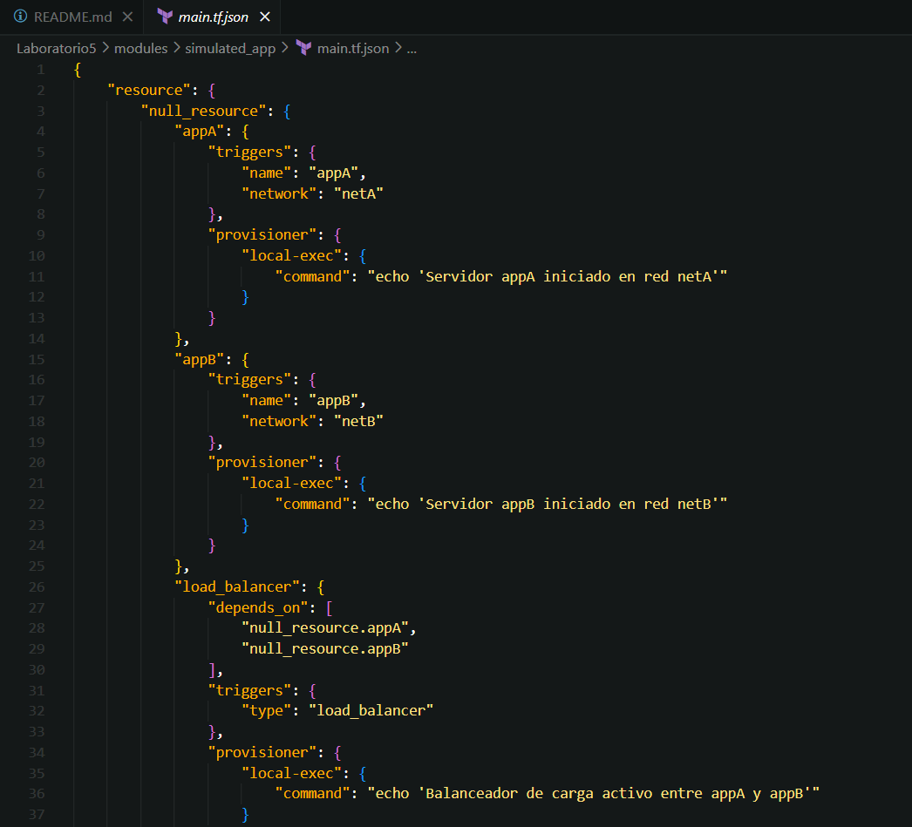
<p/>

Generamos los entornos nuevamente:
<p align="center">
    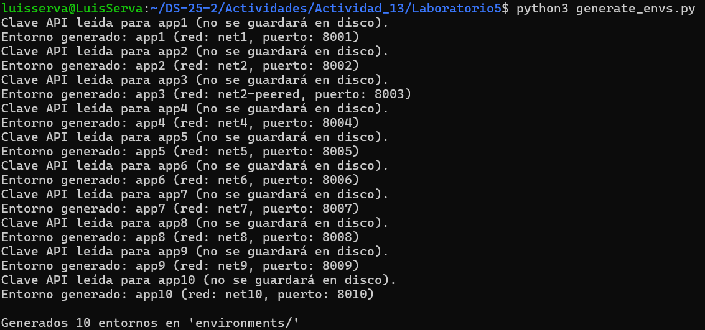
<p/>

Creamos la carpeta `environments/lb_test`:
<p align="center">
    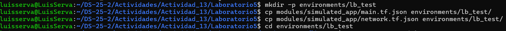
<p/>

<p align="center">
    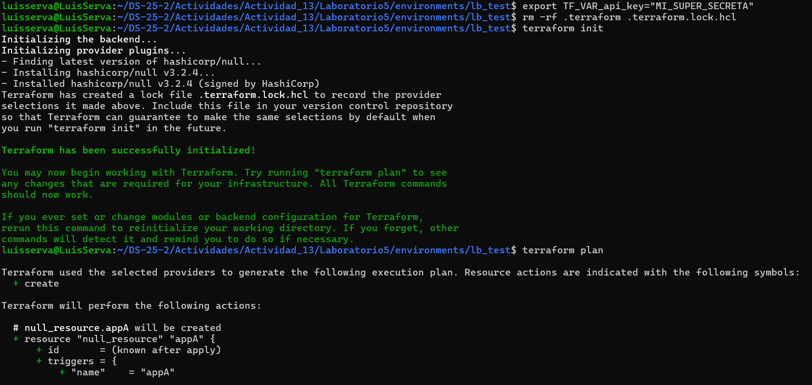
<p/>

<p align="center">
    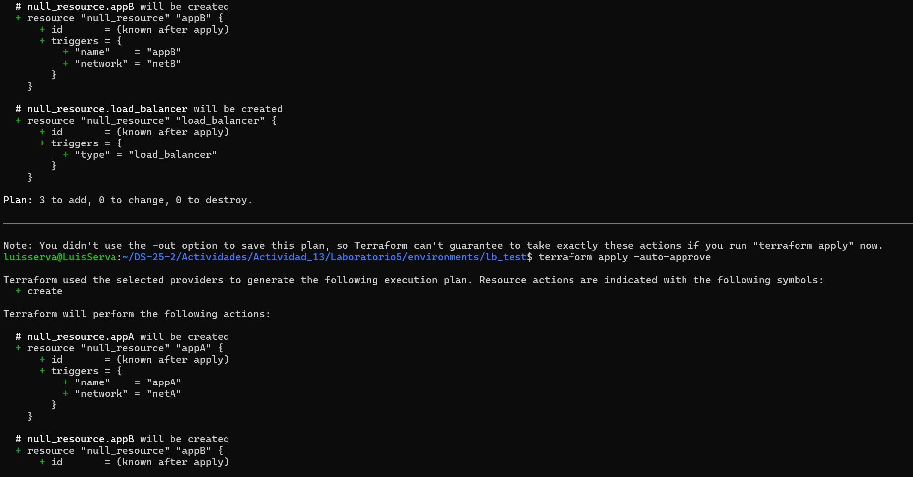
<p/>

Realizamos el cambio de `network`.
<p align="center">
    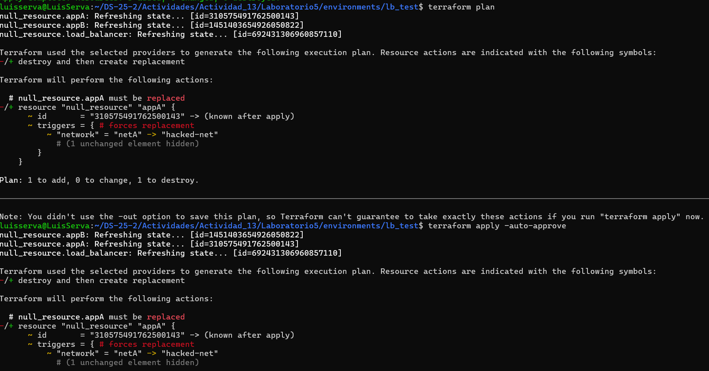
<p/>

2. **CLI Interactiva**
   
   - Refactoriza `generate_envs.py` con `click` para aceptar:
     ```bash
     python generate_envs.py --count 3 --prefix staging --port 3000
     ```
Realizamos una modificación al código `generate_envs.py` y ejecutamos la siguiente línea:
<p align="center">
    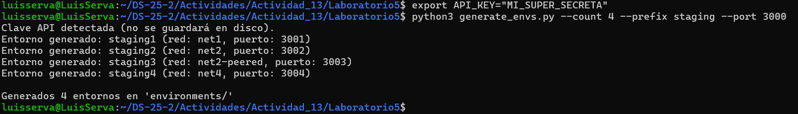
<p/>

Se implementó una interfaz de línea de comandos con `click` para parametrizar el script `generate_envs.py`, permitiendo definir la cantidad de entornos, el prefijo y el puerto base desde la terminal.
Esto hace que la generación de entornos sea más flexible y automatizada.
La variable sensible `API_KEY` se mantiene segura mediante variables de entorno, evitando exponerla en disco y mejorando las prácticas de IaC.


3. **Validación de Esquema JSON**

   - Diseña un JSON Schema que valide la estructura de ambos TF files.
   - Lanza la validación antes de escribir cada archivo en Python.

4. **GitOps Local**

   - Implementa un script que, al detectar cambios en `modules/simulated_app/`, regenere **todas** las carpetas bajo `environments/`.
   - Añade un hook de pre-commit que ejecute `jq --check` sobre los JSON.

5. **Compartición segura de secretos**

   - Diseña un mini-workflow donde `api_key` se lee de `~/.config/secure.json` (no versionado) y documenta cómo el equipo la distribuye sin comprometer seguridad.
