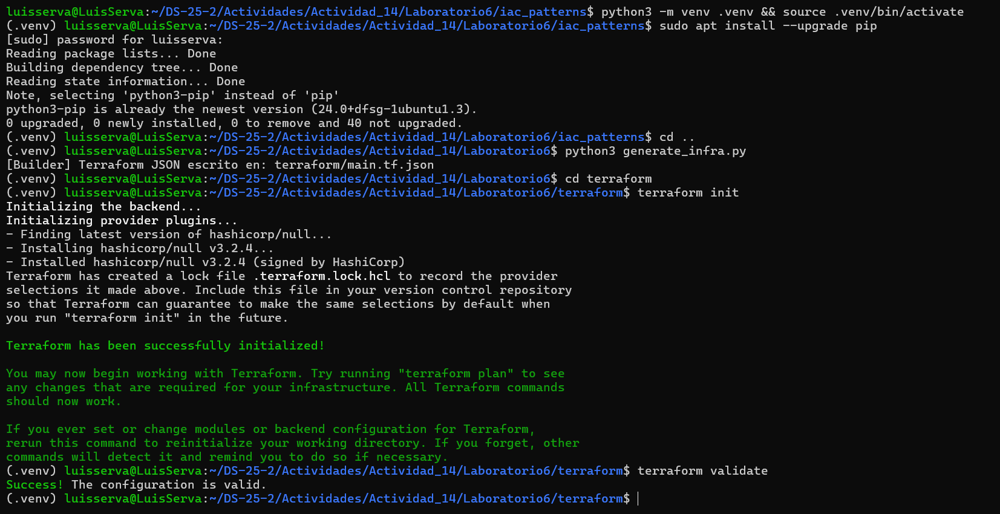
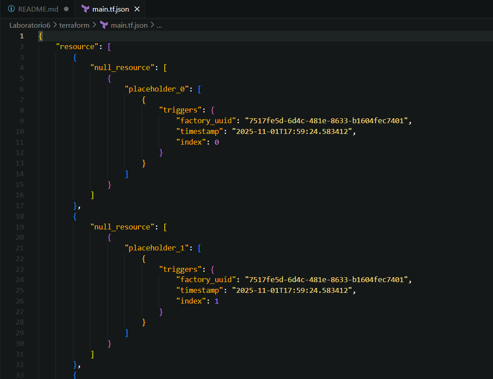
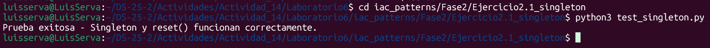
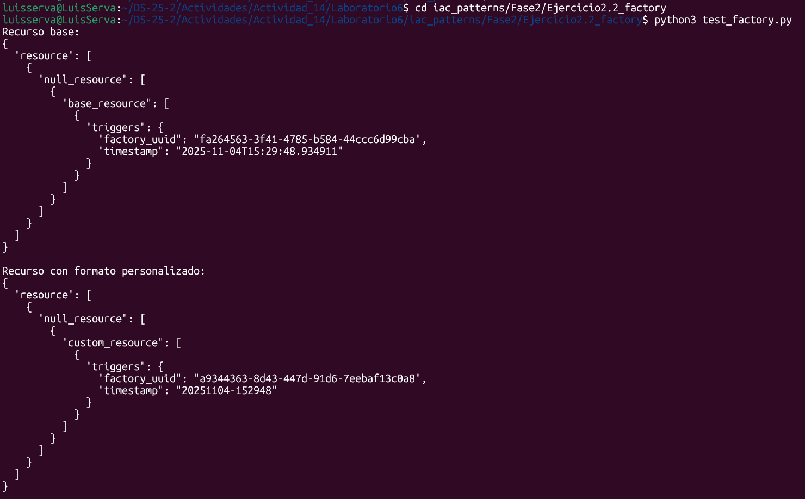
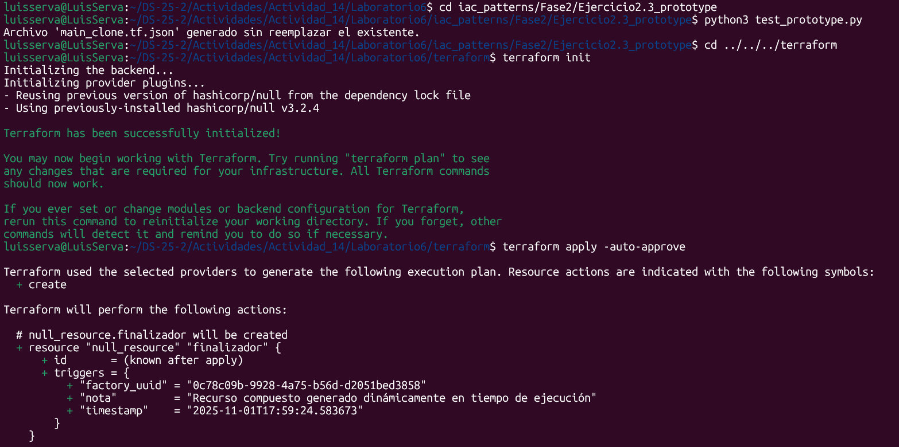
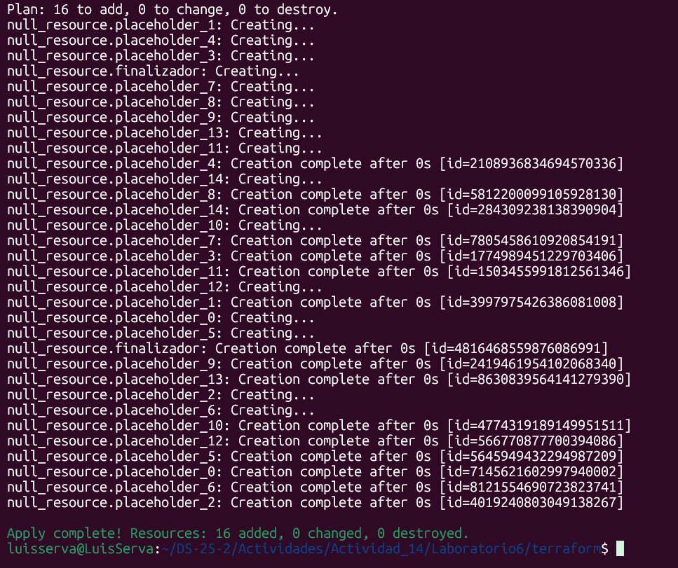
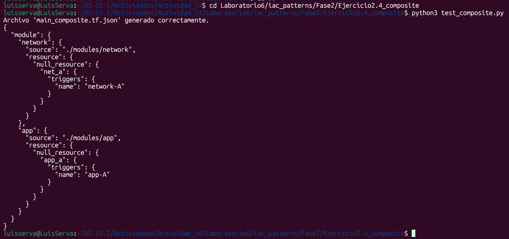
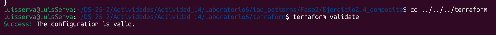
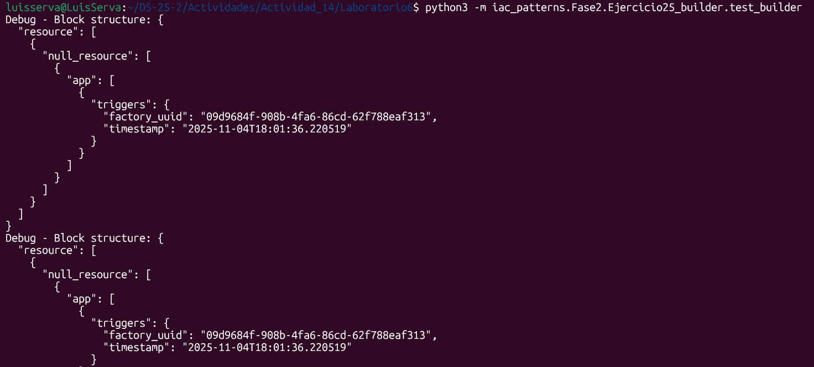

# Actividad 14: Patrones para módulos de infraestructura
Luis Andre Trujillo Serva
## Fase 0: Preparación
Realizamos la configuración inicial proporcionado por la guía y revisamos el archivo `terraform/main.tf.json`.

    

    

## Fase 1: Exploración y análisis  

En esta fase se analizan los patrones de diseño **Singleton**, **Factory**, **Prototype**, **Composite** y **Builder**, aplicados a la generación automatizada de configuraciones **Terraform** mediante **Infraestructura como Código (IaC)**.  
El objetivo es comprender cómo cada patrón contribuye a la modularidad, escalabilidad y mantenibilidad del sistema.

### 1. Patrón Singleton  

El patrón **Singleton** garantiza que solo exista una única instancia de una clase durante toda la ejecución del programa.  
Esto se logra a través de una metaclase (`SingletonMeta`) que intercepta el proceso de creación de instancias.  
La metaclase mantiene un diccionario interno donde almacena las instancias creadas y, si la clase ya fue instanciada antes, simplemente devuelve la misma referencia.

Además, utiliza un **candado de sincronización (lock)** para evitar que múltiples hilos creen instancias simultáneamente, asegurando consistencia en entornos concurrentes.  
En el contexto de IaC, este patrón permite tener un único punto de acceso para las configuraciones globales, evitando duplicación o conflictos en los parámetros de entorno.

### 2. Patrón Factory  

El patrón **Factory** encapsula la lógica de creación de objetos complejos, permitiendo construir instancias sin exponer directamente su implementación.  
En este caso, la fábrica genera estructuras JSON compatibles con Terraform, representando recursos del tipo `null_resource`.

Su función principal es estandarizar la creación de bloques de configuración y automatizar la inserción de atributos dinámicos, como un identificador único (UUID) y una marca de tiempo.  
Estos valores se almacenan en el campo `triggers`, el cual sirve para que Terraform detecte cambios y reprovisione recursos automáticamente.  

Este enfoque promueve la reutilización del código, reduce errores humanos y facilita la expansión a nuevos tipos de recursos.

### 3. Patrón Prototype  

El patrón **Prototype** permite crear copias independientes de objetos complejos a partir de un modelo base o plantilla.  
Su ventaja principal es que evita construir manualmente estructuras repetitivas, optimizando la generación de múltiples instancias similares.  

En este caso, se utiliza una copia profunda (**deepcopy**) para garantizar que cada clon sea completamente independiente, sin compartir referencias internas.  
El proceso de personalización se logra mediante una función denominada **mutator**, que modifica los atributos del clon según las necesidades (por ejemplo, renombrar recursos o agregar parámetros adicionales).

Dentro de un flujo IaC, este patrón es ideal para replicar componentes de infraestructura (como servidores o módulos) con configuraciones ligeramente distintas.

### 4. Patrón Composite  

El patrón **Composite** permite agrupar múltiples objetos o recursos individuales en una estructura jerárquica que puede manejarse como una sola unidad.  
En la práctica, este patrón combina varios bloques Terraform en un único JSON consolidado.  

Cada componente (o “hijo”) representa un recurso independiente, y el módulo principal los une recursivamente, produciendo una estructura válida para ser procesada por Terraform.  
De esta manera, el patrón facilita la creación de módulos complejos y promueve la composición de infraestructuras a gran escala, sin perder la organización o la coherencia entre los elementos.

### 5. Patrón Builder  

El patrón **Builder** coordina los demás patrones para crear sistemas completos de infraestructura paso a paso.  
Actúa como un **orquestador** que combina el poder del Factory, Prototype y Composite.  

El proceso es el siguiente:
1. El **Factory** genera un recurso base estandarizado.  
2. El **Prototype** clona y modifica el recurso tantas veces como se requiera.  
3. El **Composite** agrupa todos los clones en una estructura unificada.  
4. Finalmente, el **Builder** exporta todo el resultado a un archivo JSON que Terraform puede leer y aplicar directamente.

Gracias a este enfoque, se puede escalar la infraestructura de forma automatizada y reproducible, reduciendo la complejidad del código y mejorando su mantenibilidad.

### Flujo de interacción entre patrones  

El flujo general de interacción entre los patrones es el siguiente:

1. **Factory** crea una plantilla base del recurso a desplegar.  
2. **Prototype** clona esa plantilla y aplica mutaciones controladas para generar múltiples versiones.  
3. **Composite** agrupa todos los recursos clonados dentro de una estructura modular.  
4. **Builder** gestiona el proceso completo, conectando los pasos anteriores y exportando la configuración final.  
5. Opcionalmente, **Singleton** mantiene configuraciones globales o de entorno que se usan durante la construcción.

## Fase 2: Ejercicios prácticos
### Ejercicio 2.1: Extensión del Singleton
Este patrón asegura una única instancia global del objeto de configuración, accesible por todo el sistema.
La metaclase `SingletonMeta` controla su creación y el uso de un `threading.Lock` evita condiciones de carrera en entornos concurrentes.
El método `reset()` permite limpiar las configuraciones dinámicamente sin perder el contexto ni el tiempo de creación, útil para pruebas o reinicios controlados de IaC.

- `singleton.py` define la lógica del patrón Singleton.
- `test_singleton.py` ejecuta una simulación para:
    - Crear una configuración global.
    - Modificar y limpiar valores con `reset()`.
    - Verificar que solo exista una instancia global compartida.

    

### Ejercicio 2.2: Variación de la Factory

En este ejercicio se extiende el patrón Factory para permitir la creación de recursos Terraform del tipo `null_resource` con un formato de fecha configurable.

La clase base `NullResourceFactory` genera bloques con valores únicos (`UUID` y `timestamp ISO`) para asegurar la idempotencia y trazabilidad de los recursos.

La subclase `TimestampedNullResourceFactory` incorpora flexibilidad adicional al permitir definir el formato del timestamp (`strftime`), adaptándose a distintas convenciones temporales o requerimientos de control de versiones.

Esta implementación facilita la automatización y versionado de infraestructura como código (IaC), manteniendo compatibilidad con el formato JSON estándar de Terraform y promoviendo una estructura limpia y reutilizable para la generación de recursos dinámicos.

    

### Ejercicio 2.3: Mutaciones avanzadas con Prototype

Este ejercicio aplica el **patrón Prototype** para clonar y modificar estructuras Terraform sin alterar el recurso original.  
Se define un *mutator* que, al clonar el prototipo, **agrega dinámicamente un bloque `local_file`** con contenido de bienvenida.  
De esta forma, el clon resultante incluye tanto el recurso base (`null_resource`) como un archivo adicional (`bienvenida.txt`) generado por Terraform al ejecutar `terraform apply`.

Este enfoque demuestra cómo el patrón Prototype facilita la personalización incremental de recursos complejos mediante *deep copy* y mutaciones controladas.

    

    

### Ejercicio 2.4: Submódulos con Composite

Aquí se extiende el **patrón Composite** para permitir la agrupación jerárquica de configuraciones Terraform.  
La función `export()` fue modificada para **soportar tanto bloques `resource` como `module`**, logrando que distintos submódulos (por ejemplo, `network` y `app`) puedan combinarse en una única estructura JSON válida.

Este patrón permite manejar múltiples componentes (submódulos) como una sola unidad lógica, facilitando la organización y reutilización de infraestructura modular en Terraform.

    

    

### Ejercicio 2.5: Builder personalizado

En este ejercicio se integra todo lo aprendido implementando un **Builder fluido** que combina *Factory*, *Prototype* y *Composite* en un solo flujo de construcción.  
El nuevo método `build_group(name, size)` permite **crear submódulos repetitivos** (por ejemplo, `module -> app -> resource -> null_resource.app_0`, `app_1`, etc.), automatizando la generación de múltiples instancias a partir de un modelo base.

Con este patrón, la infraestructura puede escalar de forma declarativa y organizada. Cada grupo o submódulo puede exportarse en formato JSON listo para Terraform, reduciendo duplicación de código y manteniendo coherencia en los despliegues.

    

## Fase 3: Desafíos teórico-prácticos

