# Actividad 02
## 1.HTTP: Fundamentos y herramientas
1. Para **levantar la app** debemos descargar el archivo `Respuestas-actividad2.sh` y antes de ejecutarlo brindar permisos.

    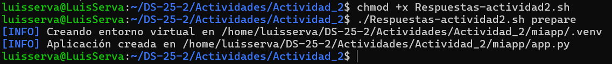

Se ha creado el entorno virtual y luego podemos ejecutar el app.py.

    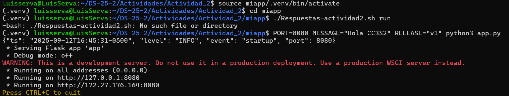

Abrimos una nueva terminal y realizamos el paso siguiente:

1. Inspección con `curl`:
- `curl -v http://127.0.0.1:8080/`

    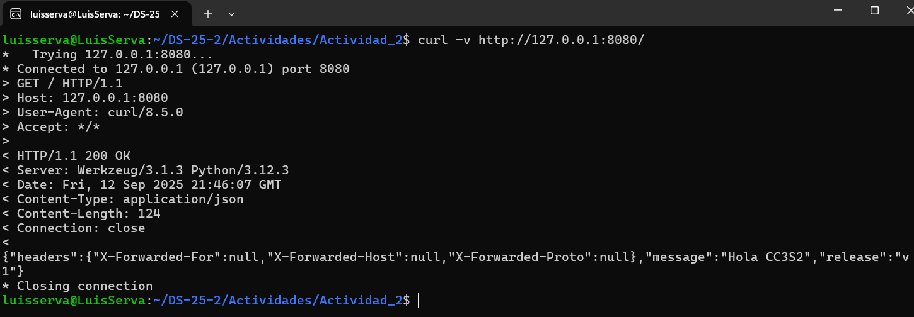

- `curl -i -X POST http://127.0.0.1:8080/` , Visualizamos la respuesta `405 Method Not Allowed` ya que la ruta existe pero no acepta el método **POST** ya que la app solo definio **GET**. Obtendriamos el error `404 Not Found` si la ruta no existiera.

    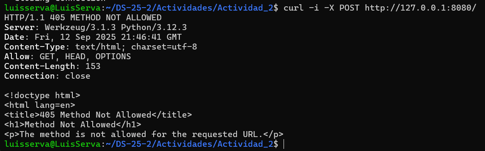

- Respuesta a la pregunta : Nada cambia cuando se encuentra en ejecución , porque `miapp/app.py` lee `APP_MESSAGE` y `APP_RELEASE` desde `os.environ` al iniciar (variables asignadas a variables globales al cargar el módulo). Cambiar las variables de entorno en otra shell no modifica el entorno del proceso que ya está corriendo. Para que una nueva variable afecte a la app hay que reiniciar el proceso (o reimplementar lectura dinámica de configuración).
  
3. Puertos abiertos con `ss`:
   

    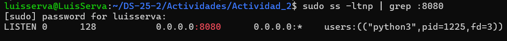

`LISTEN` : el estado del socket (esperando conexiones).

`0.0.0.0:8080` : dirección y puerto en el que escucha (todas las interfaces IPv4 en el puerto 8080).

`users:(("python3",pid=12345,fd=3))`: identifica el proceso responsable.

4. Logs como flujo

    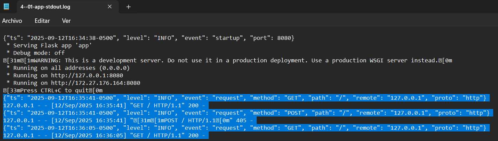

No se escriben en archivo porque, según 12-Factor, es más conveniente dividir tareas: la aplicación produce los logs, pero no se encarga de almacenarlos. En su lugar, los emite a stdout/stderr y el sistema (systemd, Docker, Kubernetes, etc.) se encarga de recolectarlos, rotarlos y almacenarlos. Esto mejora el despliegue, la portabilidad y la distribución de responsabilidades.

## 2.DNS: nombres, registros y caché
1. Host local 

Mediante el target logramos agregar y se evidencia en el siguiente `.txt`.

    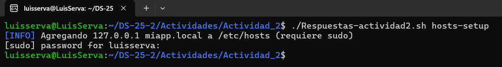

    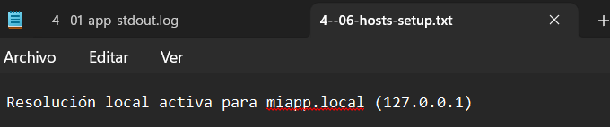

2. Comprobando resolución

Al comprobar , se generan los siguientes `.txt` en la carpeta de evidencias.

    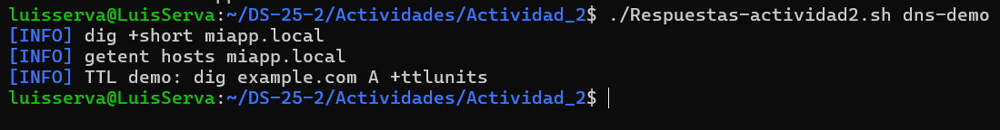

    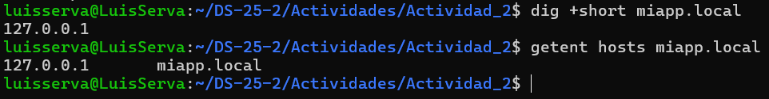

3. TTL/caché

Si haces varias consultas seguidas, el TTL va bajando hasta llegar a 0; luego el resolver vuelve a consultar al servidor autoritativo.
Esto evita sobrecarga en servidores y mejora la latencia, pero puede retrasar la propagación de cambios de DNS.

    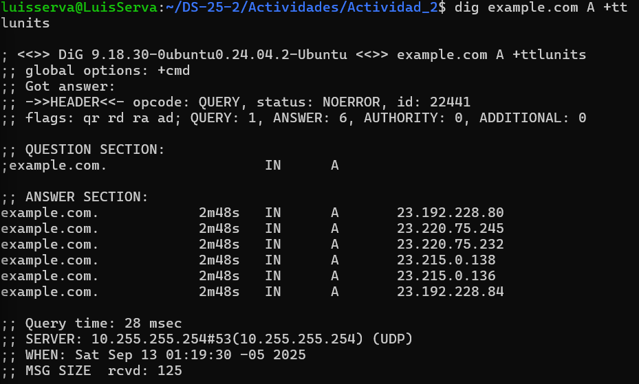

4.  Pregunta

Incluso ya hay una explicación generada por el archivo en `evidencias/4--10-hosts-vs-authoritative.txt`.

/etc/hosts es un archivo local estático que el sistema consulta antes de recurrir al DNS. No soporta TTL ni delegación.
Una zona DNS autoritativa vive en servidores que publican registros válidos para un dominio con TTLs y jerarquía.
En laboratorio, /etc/hosts sirve porque te permite simular un nombre de dominio resolviendo siempre a 127.0.0.1 sin necesidad de modificar servidores DNS públicos.

## 3.TLS: seguridad en tránsito con Nginx como reverse proxy
1. Certificado de laboratorio: 

Si volvemos a abrir WSL , necesitamos darle permiso a nuestro archivo `Respuestas-actividad2.sh` , a continuación mediante el comando `tls-cert` , se crean la carpeta certs donde genera el certificado autofirmado.

    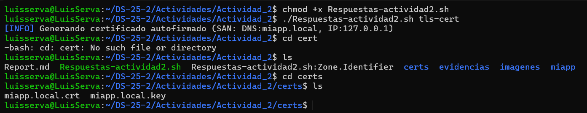

2. Configura Nginx:

    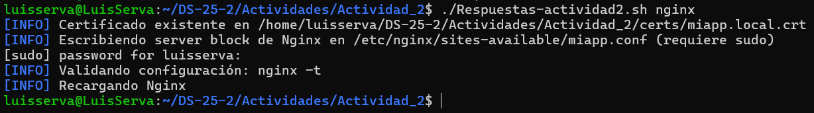

3. Valida el handshake:

    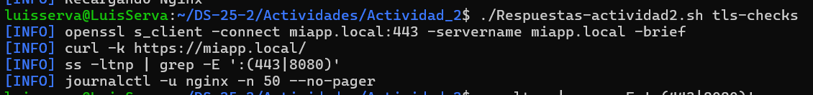

Luego , genera los siguientes archivos `.txt` en la carpeta de evidencias.

    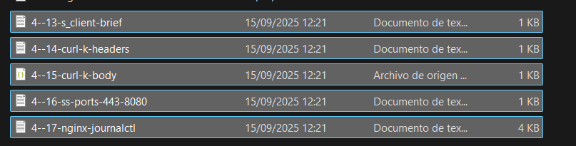

El parámetro `-k` en curl permite ignorar la validación de la cadena de confianza del certificado. Esto es necesario porque nuestro certificado es autofirmado y no está emitido por una CA reconocida por el sistema.

4. Puertos y logs:

    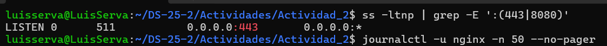

    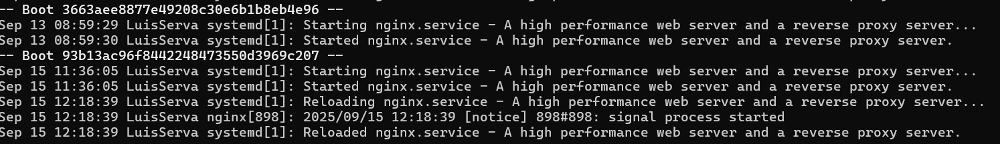

El socket de Flask se mantiene en 127.0.0.1:8080 y es accesible solo localmente.
Nginx escucha en :443, recibe las conexiones HTTPS, termina el TLS y luego reenvía el tráfico por HTTP interno hacia Flask en 127.0.0.1:8080.
Esto asegura que el cliente externo siempre entra cifrado por TLS, mientras que la comunicación entre Nginx y Flask queda dentro del mismo host.

## 4. 12-Factor App: port binding, configuración y logs
Vamos a demostrar estos tres principios clave de la app.
### Port binding: muestra que la app escucha en el puerto indicado por PORT (evidencia ss).
Levantamos la app mediante un puerto especifico :

    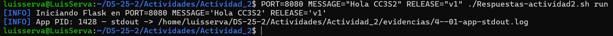

    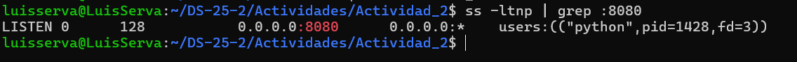

### Config por entorno: ejecuta dos veces con distintos MESSAGE/RELEASE y documenta el efecto en la respuesta JSON.
Realizamos dos ejecuciones con variables distintas y obtenemos las respuestas de tipo JSON mediante el comando `curl http://127.0.0.1:8080/`:

    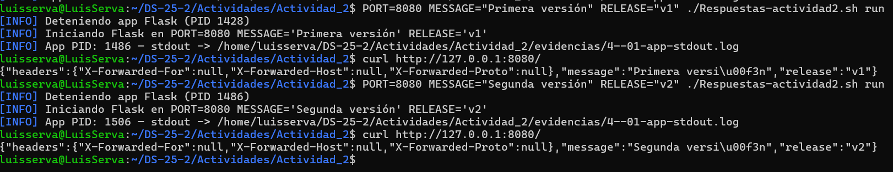

Comprobamos que la configuración depende del entorno y no del código.

### Logs a stdout: redirige a archivo mediante pipeline de shell y adjunta 5 líneas representativas. Explica por qué no se configura log file en la app.
Corremos la app redirigiendo logs a un archivo:

    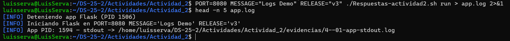

En 12-Factor, los logs no se escriben en un archivo propio, sino que se envían a stdout/stderr. Esto permite que el entorno de ejecución (systemd, Docker, Kubernetes, etc.) se encargue de recolectarlos, almacenarlos y procesarlos. Así se logra portabilidad y separación de responsabilidades.

## 5.