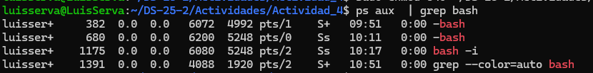

# Actividad 04 (Introducción a herramientas CLI en entornos Unix-like para DevSecOps)
---
Estudiante: Luis Andre Trujillo Serva
---
Previo a realizar los ejercicios, creamos la carpeta de evidencias y el documento donde se guardará 
el flujo de trabajo de esta actividad.

<p align="center">
    
<p/>

## Sección 01 : Manejo sólido de CLI
### Ejercicios de reforzamiento
1. Navega a `/etc`, lista archivos ocultos y redirige la salida a un archivo en tu home: `cd /etc; ls -a > ~/etc_lista.txt`.
<p align="center">
    
<p/>

Se generó el archivo `etc_lista.txt` en el home con el listado de archivos ocultos de `/etc`.

2. Usa globbing para listar todos los archivos en `/tmp` que terminen en `.txt` o `.doc`, y cuenta cuántos hay con una tubería (versión robusta): `find /tmp -maxdepth 1 -type f \( -name '*.txt' -o -name '*.doc' \) | wc -l`.
   
<p align="center">
    
<p/>

Se contó la cantidad de archivos con extensión `.txt` y `.doc` en `/tmp`.

3. Crea un archivo con `printf "Línea1\nLínea2\n" > test.txt`.
<p align="center">
    
<p/>

Al final realizamos las comprobaciones:
<p align="center">
    
<p/>

Logramos visualizar que se creo el archivo `test.txt` con su contenido  y se logro listar los archivos ocultos de la carpeta `/etc`.

## Sección 02 : Administración básica
### Ejercicios de reforzamiento
1. Crea un usuario "devsec" y agrégalo a un grupo "ops". Cambia permisos de un archivo para que solo "devsec" lo lea: `sudo adduser devsec; sudo addgroup ops; sudo usermod -aG ops devsec; touch secreto.txt; sudo chown devsec:ops secreto.txt; sudo chmod 640 secreto.txt` (usa mock si es entorno compartido).
<p align="center">
    
<p/>

El archivo `secreto.txt` quedó con permisos restringidos a devsec.

2. Lista procesos, encuentra el PID de tu shell (`ps aux | grep bash`), y envía una señal SIGTERM (no lo mates si es crítico).
<p align="center">
    
<p/>
   
3. Verifica el estado de un servicio como "systemd-logind" con `systemctl status systemd-logind`, y ve sus logs con `journalctl -u systemd-logind -n 10`.
<p align="center">
    
<p/>

<p align="center">
    
<p/>

Se consultó el estado del servicio `systemd-logind` y se obtuvieron los últimos logs.

Finalmente realizamos las comprobaciones:
<p align="center">
    
<p/>


## Sección 03 : Utilidades de texto de Unix

1. Usa grep para buscar "root" en `/etc/passwd`: `grep root /etc/passwd`.
<p align="center">
    
<p/>

2. Con sed, sustituye "dato1" por "secreto" en datos.txt: `sed 's/dato1/secreto/' datos.txt > nuevo.txt`.
<p align="center">
    
<p/>

3. Con awk y cut, extrae usuarios de `/etc/passwd`: `awk -F: '{print $1}' /etc/passwd | sort | uniq`.
<p align="center">
    
<p/>
   
4. Usa tr para convertir un texto a mayúsculas y tee para guardarlo: `printf "hola\n" | tr 'a-z' 'A-Z' | tee mayus.txt`.
<p align="center">
    
<p/>

1. (Intermedio) Encuentra archivos en `/tmp` modificados en los últimos 5 días: `find /tmp -mtime -5 -type f`.
2. Pipeline completo: `ls /etc | grep conf | sort | tee lista_conf.txt | wc -l`.
<p align="center">
    
<p/>

Por último terminamos la grabación del documento y en la carpeta de evidencias se genera los .txt del flujo del trabajo de esta actividad.
<p align="center">
    
<p/>

El uso de `script` permitió capturar el flujo de trabajo completo como evidencia.

**Archivos generados:**
```
datos.txt
etc_lista.txt
lista_conf.txt
mayus.txt
nuevo.txt
test.txt
secreto.txt
test.txt
usuarios.txt
evidencias/sesion_redactada.txt
```