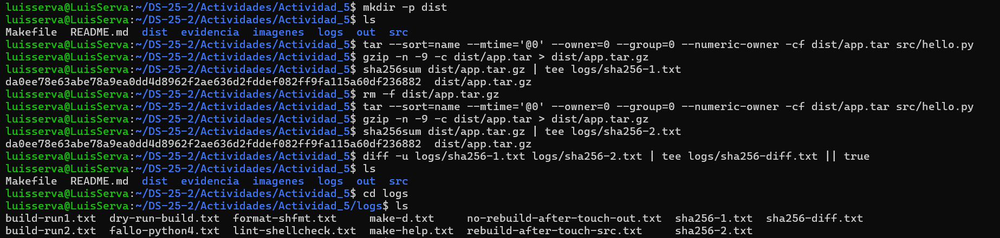
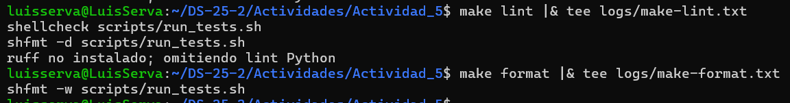

# Actividad 05 : Construyendo un pipeline DevOps con Make y Bash
Estudiante : Luis Andre Trujillo Serva
---
## Parte 01 : Construir - Makefile y Bash desde cero
### 1.1 Crear un script Python simple
Iniciamos creando los archivos `__init__.py` y `hello.py` , por último agregamos el `Makefile` proporcionado en la guia.
<p align="center">
    
<p/>

### 1.2 Crear un Makefile básico
1. Ejecuta `make help` y guarda la salida para análisis. Luego inspecciona `.DEFAULT_GOAL` y `.PHONY` dentro del Makefile. 
   
<p align="center">
    
<p/>

**Respuesta**

`help` imprime todos los targets que tenemos declarados en nuestro Makefile , además de su respectiva descprición y de acuerdo al comando proporcionado en la guía , este resultado se almacena en `logs/make-help.txt`. Luego , `.DEFAULT_GOAL := help` establece que si se ejecuta `make` sin argumentos , entonces ejecuta por defecto el target de `help` en lugar de intentar compilar algo. Por último , la utilidad de `PHONY` para objetivos como `all`, `clean` o `help` garantiza que siempre se ejecuten, aunque existan archivos con el mismo nombre. De esta forma, se evitan ambigüedades y se asegura un comportamiento consistente.


2. Comprueba la generación e idempotencia de `build`. Limpia salidas previas, ejecuta `build`, verifica el contenido y repite `build` para constatar que no rehace nada si no cambió la fuente.

<p align="center">
    
<p/>

**Respuesta**

En la primera ejecución de `make build`, se creó la carpeta `out/` y se generó el archivo `out/hello.txt` con la salida del script `src/hello.py`.  
En el segundo comando , Make respondió *“Nothing to be done for 'build'”*, ya que el target estaba actualizado: el archivo fuente no había cambiado y `out/hello.txt` seguía siendo más reciente.  
Esto demuestra la **idempotencia** de `build`: si no se modifica el archivo fuente, el target no se vuelve a generar. El comando `stat` confirmó la misma marca de tiempo, validando que no hubo reconstrucción innecesaria.

3. Fuerza un fallo controlado para observar el modo estricto del shell y `.DELETE_ON_ERROR`. Sobrescribe `PYTHON` con un intérprete inexistente y verifica que no quede artefacto corrupto.

<p align="center">
    
<p/>

**Respuesta**

Primero eliminamos el archivo `out/hello.txt`. Luego forzamos la ejecución con `PYTHON=python4`, un intérprete inexistente. Make intentó correr , creó el directorio `out/`, pero al no encontrar `python4` se produjo un error y la ejecución se detuvo inmediatamente gracias al **modo estricto** de Bash (`-e -u -o pipefail`).  
La directiva `.DELETE_ON_ERROR` garantizó que el archivo `out/hello.txt` fuera borrado automáticamente, evitando que quedara un artefacto corrupto. Finalmente, al listar el archivo comprobamos que no existe, confirmando que el rollback funcionó correctamente y el sistema mantuvo un estado consistente.

4. Realiza un "ensayo" (dry-run) y una depuración detallada para observar el razonamiento de Make al decidir si rehacer o no. 

<p align="center">
    
<p/>

**Respuesta**

Con `make -n build` vimos que Make solo nos muestra los comandos que ejecutaría, sin llegar a correrlos.  
Luego, con `make -d build`, Make fue explicando paso a paso cómo analiza: primero revisa el `Makefile`, después verifica si existe `out/hello.txt` y al no encontrarlo decide rehacerlo.  
Se observa en el log frases como *“Must remake target 'out/hello.txt’”* y al final *“Successfully remade target file 'build’”*, lo que confirma que entendió la dependencia y ejecutó las recetas.  


5. Demuestra la incrementalidad con marcas de tiempo. Primero toca la fuente y luego el target para comparar comportamientos.

<p align="center">
    
<p/>

Cuando modificamos `src/hello.py` con `touch`, Make detectó que el archivo fuente era más reciente que el target y por eso rehizo `out/hello.txt`.  
En cambio, al usar `touch` sobre el propio target (`out/hello.txt`), no se generó nada nuevo: Make entiende que el archivo ya está actualizado porque la fuente no cambió.  
Esto demuestra que la reconstrucción depende de la relación **fuente → target**, no de cambios artificiales en el target.  
De esta forma se garantiza eficiencia: solo se rehace lo necesario y se evita trabajo extra.

6. Ejecuta verificación de estilo/formato manual (sin objetivos `lint/tools`). Si las herramientas están instaladas, muestra sus diagnósticos; si no, deja evidencia de su ausencia.

<p align="center">
    
<p/>

**Respuesta**

Al ejecutar `shellcheck` y `shfmt` sobre `scripts/run_tests.sh`, los logs mostraron que el archivo no existe en el proyecto actual. Esto significa que no hubo nada que analizar ni formatear, pero los comandos se ejecutaron de forma controlada y los resultados quedaron guardados en `logs/lint-shellcheck.txt` y `logs/format-shfmt.txt`.  
Este ejercicio demuestra que el pipeline está preparado para manejar la ausencia de archivos o herramientas sin romperse, generando siempre evidencia clara de lo ocurrido.

7. Construye un paquete reproducible de forma manual, fijando metadatos para que el hash no cambie entre corridas idénticas. Repite el empaquetado y compara hashes.

<p align="center">
    
<p/>

**Respuesta**

En este ejercicio generamos y comprimimos el paquete dos veces, obteniendo el mismo hash SHA256 en ambas ejecuciones:  

Esto se logró gracias a las opciones usadas en `tar` y `gzip`:  
- `--sort=name` asegura que los archivos se empaquen siempre en el mismo orden.  
- `--mtime=@0` fija la fecha de modificación a un valor constante.  
- `--owner=0 --group=0 --numeric-owner` establecen usuarios y grupos a valores fijos.  
- `gzip -n` evita que se agreguen nombres de archivo o marcas de tiempo en la compresión.  

De esta forma eliminamos fuentes de variabilidad y garantizamos que el artefacto sea idéntico en cada ejecución, validando la reproducibilidad del build.

8. Reproduce el error clásico "missing separator" sin tocar el Makefile original. Crea una copia, cambia el TAB inicial de una receta por espacios, y confirma el error.

<p align="center">
    
<p/>

**Respuesta**

Make requiere que todas las líneas de receta comiencen con un **TAB**, no con espacios. Si se usan espacios, aparece el error clásico *“missing separator”*, como se vio en la línea 26 de `Makefile_bad`.  
Este problema es fácil de diagnosticar porque Make indica el número de línea y el mensaje es muy específico. La evidencia del error quedó registrada en `evidencia/missing-separator.txt`, confirmando el comportamiento esperado.

### 1.3 Crear un script Bash
Creamos la carpeta `scripts/` , además el archivo `run_tests.sh` y agregamos su contenido , por último , damos permisos a dicho archivo.
<p align="center">
    
<p/>

##### Ejercicios
- Ejecuta ./scripts/run_tests.sh en un repositorio limpio. Observa las líneas "Demostrando pipefail": primero sin y luego con pipefail. Verifica que imprime "Test pasó" y termina exitosamente con código 0 (`echo $?`).
<p align="center">
    
<p/>

- Edita src/hello.py para que no imprima "Hello, World!". Ejecuta el script: verás "Test falló", moverá hello.py a hello.py.bak, y el trap lo restaurará. Confirma código 2 y ausencia de .bak.

En este caso modificamos el archivo `hello.py`.

```python
def greet(name):
    return f"Hello, {name}!"

if __name__ == "__main__":
    print(greet("Mundo"))
```
**Resultado**
<p align="center">
    
<p/>

- Ejecuta `bash -x scripts/run_tests.sh` . Revisa el trace: expansión de `tmp` y `PY`, llamadas a funciones, here-doc y tuberías. Observa el trap armado al inicio y ejecutándose al final; estado 0.

<p align="center">
    
<p/>

- Sustituye `output=$("$PY" "$script")` por `("$PY" "$script")`. Ejecuta script. `output` queda indefinida; con `set -u`, al referenciarla en `echo` aborta antes de `grep`. El trap limpia y devuelve código distinto no-cero.

<p align="center">
    
<p/>

<p align="center">
    
<p/>

El cambio funcionó correctamente: provocó que `output` quedara indefinida, activó el modo estricto (`set -u`), y demostró cómo `trap` asegura limpieza incluso en fallos. El código de salida 2 confirma que se manejó como un fallo de test.

## Parte 2: Leer - Analizar un repositorio completo
### 2.1 Test de ejemplo

- Ejecuta make -n all para un dry-run que muestre comandos sin ejecutarlos; identifica expansiones $@ y $<, el orden de objetivos y cómo all encadena tools, lint, build, test, package.

    <p align="center">
        
    <p/>

    - `make -n all` muestra que `all` actúa como agregador, encadenando en orden: `tools → lint → build → test → package`.

    - Esto permite revisar qué se ejecutaría sin modificar nada en el sistema, útil para depuración y validación de flujos.

    - La expansión de `$@` y `$<` confirma cómo Make sustituye esas variables automáticas en las recetas.

- Ejecuta make -d build y localiza líneas "Considerando el archivo objetivo" y "Debe deshacerse", explica por qué recompila o no out/hello.txt usando marcas de tiempo y cómo mkdir -p $(@D) garantiza el directorio.

<p align="center">
        
<p/>

En `make -d build` se observa cómo Make analiza dependencias: primero revisa `src/hello.py` y luego el target `out/hello.txt`.  
Si la fuente está más nueva, decide `"Must remake"` y vuelve a ejecutar la receta, generando el archivo actualizado.  
En cambio, si no hubo cambios, aparece `"No need to remake"`.  
La instrucción `mkdir -p $(@D)` evita errores asegurando que el directorio `out/` exista antes de escribir el target.  

- Fuerza un entorno con BSD tar en PATH y corre make tools; comprueba el fallo con "Se requiere GNU tar" y razona por qué --sort, --numeric-owner y --mtime son imprescindibles para reproducibilidad determinista.

<p align="center">
        
<p/>

Al forzar un `tar` no compatible (BSD), `make tools` falla con el mensaje `Se requiere GNU tar`.  
Esto ocurre porque el Makefile valida que `tar --version` contenga la cadena `GNU tar`.  
Es imprescindible ya que la reproducibilidad depende de banderas exclusivas de GNU tar:  
`--sort=name` para ordenar entradas, `--mtime` para fijar fechas, y `--numeric-owner` para normalizar propietarios.  
Con BSD tar, los artefactos cambiarían entre ejecuciones y romperían la reproducibilidad.  
  
- Ejecuta make verify-repro; observa que genera dos artefactos y compara SHA256_1 y SHA256_2. Si difieren, hipótesis: zona horaria, versión de tar, contenido no determinista o variables de entorno no fijadas.

<p align="center">
        
<p/>

El comando `make verify-repro` ejecuta dos empaquetados consecutivos y compara sus hashes SHA256.  
En mi entorno los resultados fueron idénticos, confirmando que el build es 100% reproducible. 
  
- Corre make clean && make all, cronometrando; repite make all sin cambios y compara tiempos y logs. Explica por qué la segunda es más rápida gracias a timestamps y relaciones de dependencia bien declaradas.

<p align="center">
    
<p/>

Al ejecutar `make clean && make all`, se borran artefactos y se reconstruye desde cero, por lo que tarda más tiempo.  
En la segunda corrida de `make all`, como no hubo cambios, Make detecta que los targets ya están al día.  
El resultado es inmediato.  
Esto demuestra cómo las marcas de tiempo y dependencias bien definidas permiten builds incrementales eficientes.  
  
- Ejecuta PYTHON=python3.12 make test (si existe). Verifica con python3.12 --version y mensajes que el override funciona gracias a ?= y a PY="${PYTHON:-python3}" en el script; confirma que el artefacto final no cambia respecto al intérprete por defecto.

<p align="center">
    
<p/>

Probando con `PYTHON=python3.12 make test`, Make usó el intérprete alternativo en todas las recetas.  
El script `run_tests.sh` también respetó esa variable al evaluar `PY="${PYTHON:-python3}"`.  
La prueba confirma que el override funciona, pero el resultado final (`out/hello.txt`) es idéntico,  
ya que la lógica del programa no depende de la versión de Python utilizada.  
  

- Ejecuta make test; describe cómo primero corre scripts/run_tests.sh y luego python -m unittest. Determina el comportamiento si el script de pruebas falla y cómo se propaga el error a la tarea global.

<p align="center">
    
<p/>

El objetivo `make test` primero ejecuta el script Bash `scripts/run_tests.sh` y después corre los tests de Python con unittest.  
Si el script Bash falla (por ejemplo, no encuentra `Hello, World!`), Make interrumpe la receta inmediatamente.  
De esta manera el error se propaga hasta `make test`, que devuelve código distinto de cero y marca la tarea como fallida.  
Este comportamiento asegura que un fallo temprano bloquee toda la cadena de pruebas.  

- Ejecuta touch src/hello.py y luego make all; identifica qué objetivos se rehacen (build, test, package) y relaciona el comportamiento con el timestamp actualizado y la cadena de dependencias especificada.

<p align="center">
    
<p/>

Al ejecutar `touch src/hello.py`, el timestamp del archivo fuente se actualizó.  
Make detecta que el target `out/hello.txt` está desactualizado y rehace `build`.  
Esto provoca que también se ejecuten `test` y `package`, ya que dependen de ese target.  
De esta forma se garantiza que cualquier cambio en el código fuente recorra toda la cadena de construcción.  

- Ejecuta make -j4 all y observa ejecución concurrente de objetivos independientes; confirma resultados idénticos a modo secuencial y explica cómo mkdir -p $(@D) y dependencias precisas evitan condiciones de carrera.

<p align="center">
    
<p/>

Al correr `make -j4 all`, Make ejecuta en paralelo los objetivos que no dependen entre sí, reduciendo el tiempo total. Se observa que `lint`, `build` y `test` se entrelazan en la salida, pero todos respetan las dependencias gracias a `mkdir -p $(@D)` y reglas bien declaradas. El resultado final es idéntico al modo secuencial, con la ventaja de aprovechar la concurrencia sin condiciones de carrera.


- Ejecuta make lint y luego make format; interpreta diagnósticos de shellcheck, revisa diferencias aplicadas por shfmt y, si está disponible, considera la salida de ruff sobre src/ antes de empaquetar.
<p align="center">
    
<p/>

En este ejercicio corrimos `make lint` y vimos que revisa la calidad del código: `shellcheck` nos da consejos de buenas prácticas en Bash y `shfmt` sugiere un formato más limpio. Como `ruff` no está instalado, el Makefile simplemente lo avisa sin detener la ejecución.  
Después, al correr `make format`, `shfmt` aplicó directamente las correcciones de estilo en el script. De esta forma, garantizamos que el código quede consistente y más fácil de leer sin que tengamos que editarlo a mano.  

## Parte 3: Extender
### 3.1 lint mejorado
Eliminamos las comillas en `"$output"` y al ejecutar el primer comando visualizamos que `shellcheck` reconoce ese error , lo corregimos y ejecutamos nuevamente , ahora todo funciona correctamente. Luego, con `make format`, `shfmt` aplicó correcciones de estilo automáticamente, manteniendo el script más limpio y consistente. Si `ruff` estuviera disponible, también podría revisarse el código Python, aunque su ausencia no bloquea la build.  
<p align="center">
    
<p/>

### 3.2 Rollback adicional
<p align="center">
    
<p/>

<p align="center">
    
<p/>

<p align="center">
    
<p/>

### 3.3 Incrementalidad
<p align="center">
    
<p/>

- **Primera ejecución de `make benchmark`:**  
  Se construyeron todos los objetivos desde cero (`out/hello.txt`, pruebas y `dist/app.tar.gz`). El tiempo fue mayor porque ejecutó todos los pasos completos.

- **Segunda ejecución de `make benchmark`:**  
  Como no hubo cambios en el código, `make` detectó que los artefactos estaban actualizados y **no recompiló nada**. El tiempo fue mucho menor, ya que solo verificó marcas de tiempo.

- **Después de modificar `src/hello.py` con `touch`:**  
  Make notó que el archivo fuente cambió y reconstruyó solo lo necesario: volvió a generar `hello.txt`, corrió los tests y empaquetó de nuevo el `app.tar.gz`.

#### Checklist de Smoke-Tests - Bootstrap
<p align="center">
    
<p/>
Logramos confirmar los permisos de ejecución y todas las herramientas están instaladas correctamente. 

#### Checklist de Smoke-Tests - Primera pasada
<p align="center">
    
<p/>

#### Checklist de Smoke-Tests - Incrementalidad
<p align="center">
    
<p/>

Este flujo confirma que el sistema de dependencias de `make` está funcionando correctamente: rápido cuando no hay cambios, y preciso al detectar modificaciones en el código fuente.

#### Checklist de Smoke-Tests - Rollback
<p align="center">
    
<p/>

Modificamos el archivo `hello.py` y obtenemos dicho error , por último se resatura la versión anterior con el último comando.

#### Checklist de Smoke-Tests - Lint y formato
<p align="center">
    
<p/>

#### Checklist de Smoke-Tests - Limpieza
<p align="center">
    
<p/>

#### Checklist de Smoke-Tests - Reproducibilidad
<p align="center">
    
<p/>

Ambos `SHA256` son iguales por eso obtenemos la respuesta de reproducible.